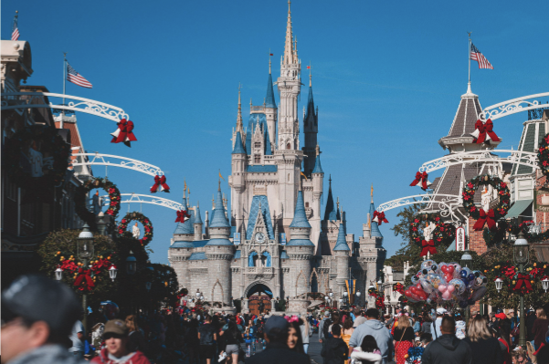

# Keep it Simba’l

## Machine Learning Project

### Background
Disneyland is the most magical place on earth and thousands of people visit every year. In this study, we are looking to analyze visitors’ experience by looking at the reviews for 3 different parks Hong Kong, California, and Paris. However, numbers and star reviews do not give an accurate picture of the full experience visitors enjoy at Disney Parks. By analyzing text reviews, Disney Parks can learn more about their visitors and their needs and wants; and the metrics associated with good reviews. After all, qualitative data can inform action items better. 

### Motivation
We want to analyze tourism flow for Disney and help Disney qualitatively understand their customer experience. We want to see what are the common complaints associated with low ratings and common reviews associated with high ratings. What words are associated with high ratings, what words are used to describe different parks, and which words are visitors from different countries more likely to use?  In the end, quantitative data can only help Disney theme parks to a certain extent. Being able to parse qualitative textual data can help improve customer experiences and guide business decisions for the benefit of both Disney Parks and Disney visitors. 
Also, this project will explore the limitations of quantitative data; and demonstrate how qualitative data from written reviews can supplement quantification. Instead of just asking questions of which and how much, textual data can open the door for finding out why the numbers are one way or another.  
